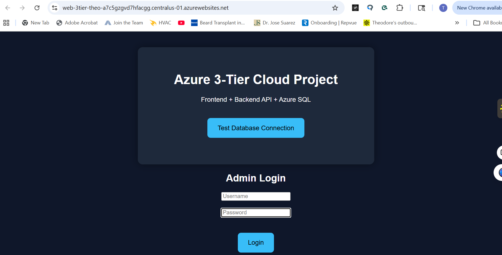
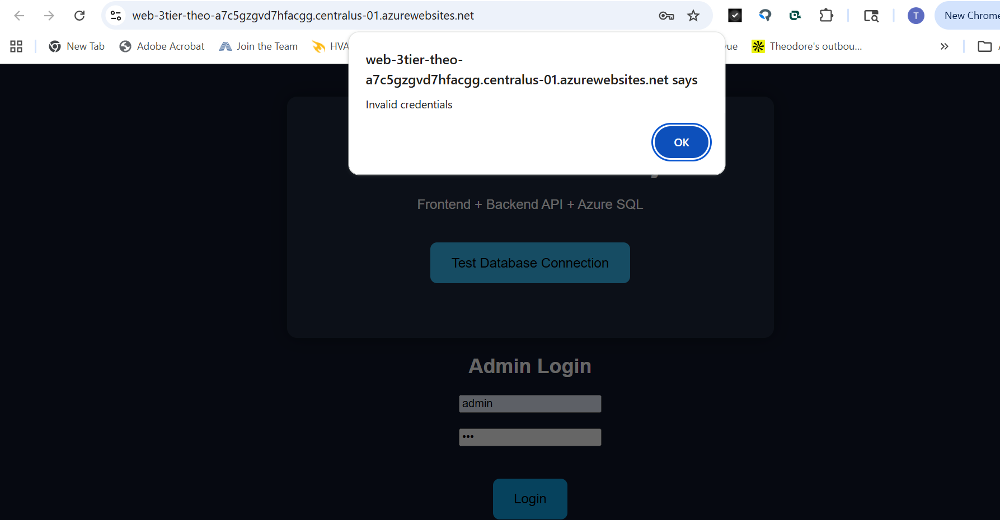
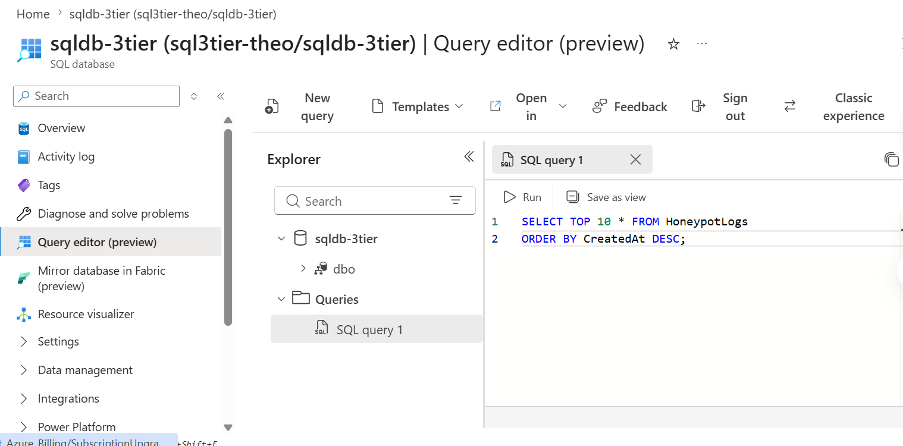
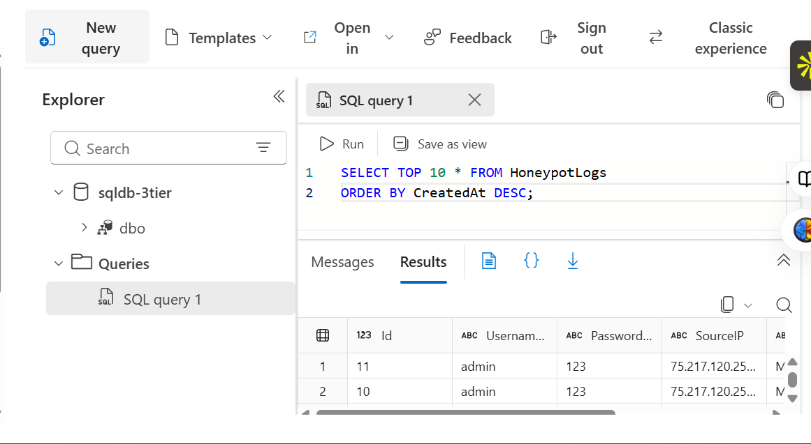
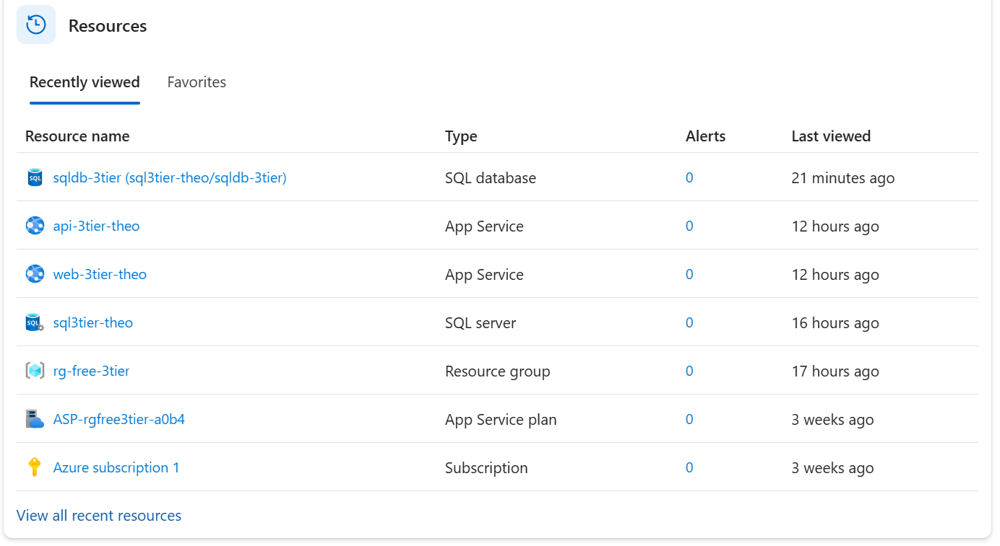
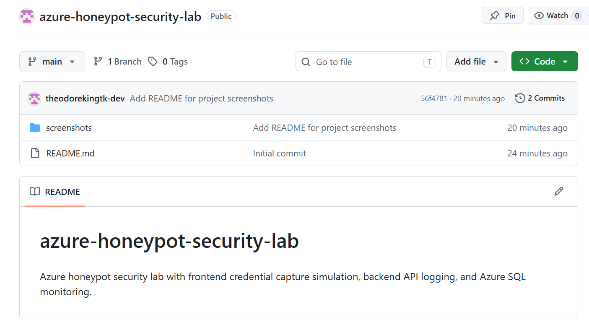

# Azure Honeypot Security Lab

A cloud security project built in Microsoft Azure that simulates a credential harvesting honeypot using a frontend login portal, backend Node.js API, and Azure SQL database logging system.

This project was designed to demonstrate practical cloud engineering, web application deployment, backend API integration, database monitoring, and basic security operations concepts in a real Azure environment.

---

# Project Objectives

The purpose of this lab was to:

- Build and deploy a 3-tier cloud application in Azure
- Simulate malicious credential capture activity
- Log authentication attempts into Azure SQL
- Demonstrate backend API communication
- Practice cloud troubleshooting and deployment workflows
- Gain hands-on experience with Azure App Services and SQL databases
- Create a portfolio-ready cloud security project

---

# 3-Tier Architecture

## Frontend Layer

The frontend layer consists of a hosted HTML/CSS/JavaScript login portal deployed through Azure App Service.

### Functions:
- Displays simulated admin login portal
- Sends login attempts to backend API
- Tests database connectivity
- Demonstrates frontend-to-backend communication

---

## Backend API Layer

The backend layer is powered by Node.js and Express.js running in Azure App Service.

### Functions:
- Receives login requests
- Processes API calls
- Logs attempted usernames/passwords
- Captures source IP addresses
- Stores request metadata into Azure SQL
- Handles database connectivity

---

## Database Layer

The database layer uses Azure SQL Database to store honeypot logging information.

### Functions:
- Stores credential attempts
- Stores timestamps
- Stores IP addresses
- Stores user-agent information
- Demonstrates cloud-hosted SQL monitoring workflows

---

# Cloud Security Concepts Demonstrated

This project demonstrates several real-world security concepts including:

- Honeypot credential collection
- Login monitoring
- Backend request logging
- Security event storage
- SQL-based monitoring
- Web application architecture
- Cloud infrastructure deployment
- Security operations workflows
- API/database integration
- Incident investigation concepts

---

# Technologies Used

## Cloud Platforms
- Microsoft Azure

## Azure Services
- Azure App Service
- Azure SQL Database
- Azure Resource Groups

## Backend Technologies
- Node.js
- Express.js
- MSSQL Node Driver

## Frontend Technologies
- HTML5
- CSS3
- JavaScript

## Development Tools
- GitHub
- Visual Studio Code

---

# Deployment Workflow

The project deployment included:

1. Creating Azure Resource Groups
2. Deploying Azure SQL Database
3. Configuring Azure SQL firewall rules
4. Building backend API server
5. Deploying Node.js API to Azure App Service
6. Building frontend login portal
7. Connecting frontend to backend API
8. Connecting backend API to Azure SQL
9. Testing credential logging functionality
10. Monitoring SQL query results

---

# Key Challenges Solved

Throughout the project, several real-world cloud engineering issues were encountered and resolved:

- DNS and App Service deployment issues
- Node.js deployment troubleshooting
- API routing failures
- Express middleware configuration problems
- JSON body parsing errors
- SQL connection string troubleshooting
- Azure environment variable configuration
- Database query debugging
- Frontend-to-backend communication failures

These troubleshooting scenarios provided valuable hands-on cloud engineering experience.

---

# Screenshots

## Frontend Login Page

---

## Invalid Login Attempt

---

## Azure SQL Query Editor

---

## Honeypot SQL Logs

---

## Azure Resources Dashboard

---

## GitHub Repository Overview

---

# Project Results

Successfully achieved:

- Fully deployed Azure 3-tier application
- Working frontend login portal
- Working backend Node.js API
- Working Azure SQL integration
- Live credential logging
- Cloud-hosted infrastructure
- Portfolio-ready cloud security project

---

# Future Improvements

Potential future upgrades include:

- Azure Sentinel integration
- SIEM alerting workflows
- Geolocation tracking
- Threat intelligence enrichment
- Real-time dashboards
- Admin analytics panel
- Docker containerization
- Terraform deployment automation
- Azure Key Vault integration
- Multi-region deployment

---

# Author

## Theodore King

Cloud Security | Azure | AWS | ServiceNow | Infrastructure & Security Projects
